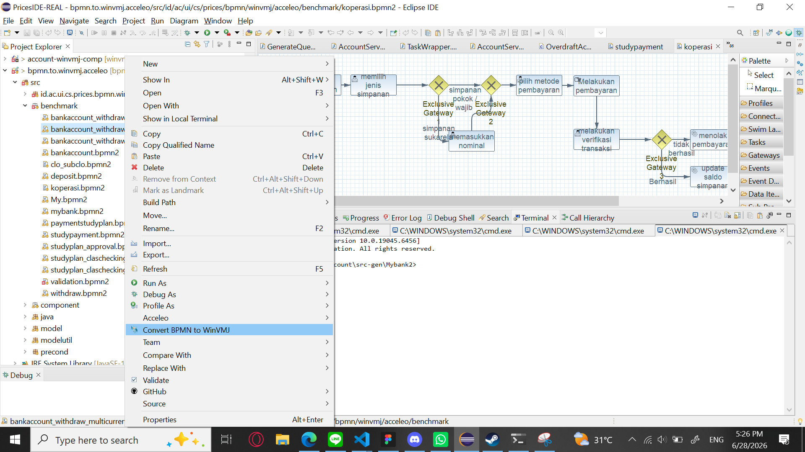
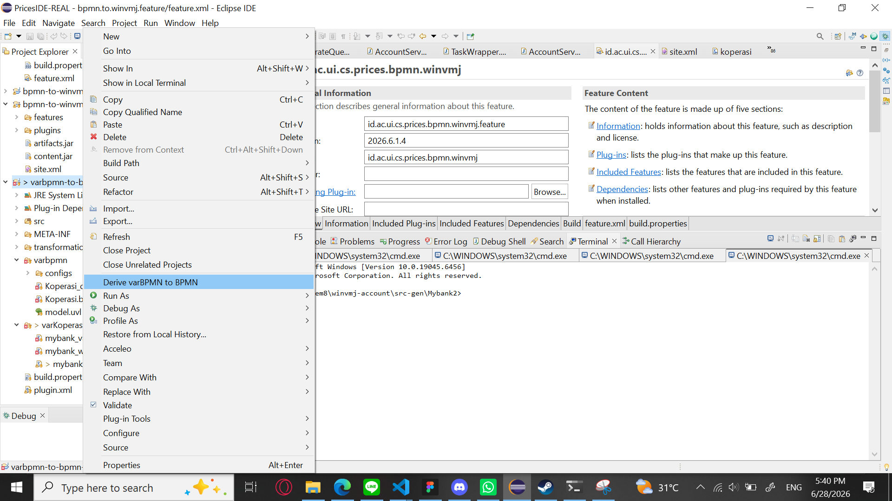

# How to run the project
To run this project, you must first be in an eclipse application.
Then import this whole project into eclipse. This will result in you having all the modules inside your file explorer.

To run the plugin as a whole, right click on the bpmn-to-winvmj-plugin folder and select "run as" > "eclipse application". This will open another eclipse instance where your plugin will be accessible to be used.

To know whether your build is correct or not. Create a random BPMN2 file inside your file explorer or you can use one of the ones in `bpmn-to-winvmj-acceleo\src\id\ac\ui\cs\prices\bpmn\winvmj\acceleo\benchmark`.
Right click the file and the "convert bpmn to winvmj" menu should be available if the build is correct.

another one you have to check out is the varBPMN plugin.
varBPMN is correctly build if this menu is visible when a folder with var in the name is right clicked

# File structure
`bpmn-to-winvmj-acceleo` is used as the primary tool to convert a BPMN file into ResourceImpl and friends codes. You can read more relating to this project in `bpmn-to-winvmj-acceleo\README.md`

`varbpmn-to-bpmn-transformer` is used to transform varBPMN diagrams into a normal BPMN file which then can be consumed by `bpmn-to-winvmj-acceleo` as an input.

Both build result of `bpmn-to-winvmj-acceleo` and `varbpmn-to-bpmn-transformer` will then be embeded inside the plugin when `bpmn-to-winvmj-plugin` is built.

To build the `bpmn-to-winvmj-plugin`, you must first remove preexisting artifacts.jar and content.jar inside `bpmn-to-winvmj-plugin-update`, then open site.xml and add the `id.ac.ui.cs.prices.bpmn.winvmj.feature` feature.

# Contributor
Here are the list of people who have contributed their blood, sweat and tears for this project
- Kenichi Komala
- Dwiky Ahmad Megananta