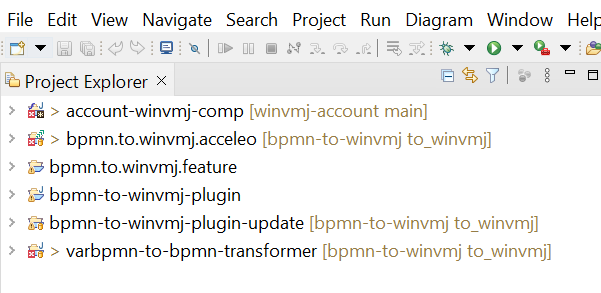
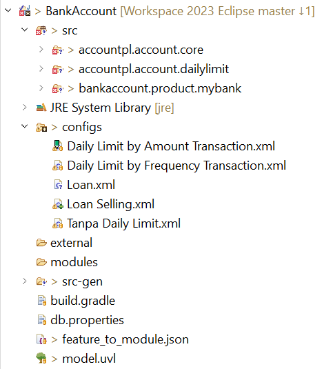
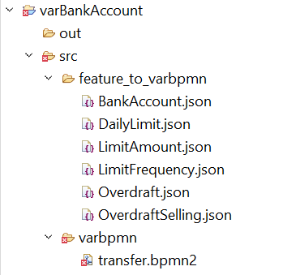
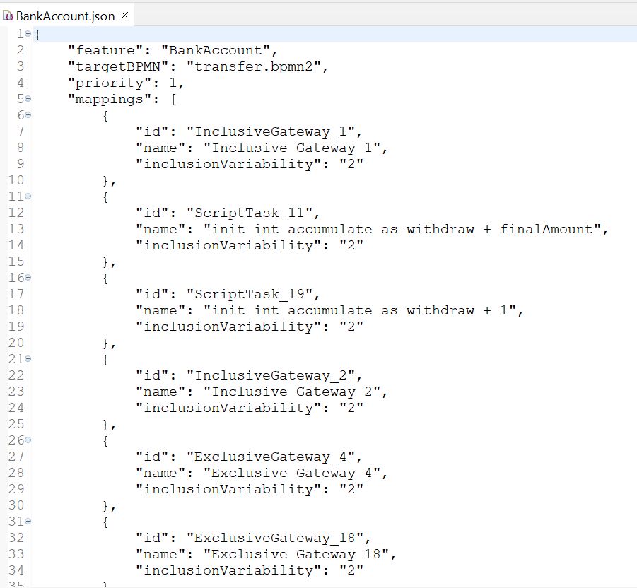
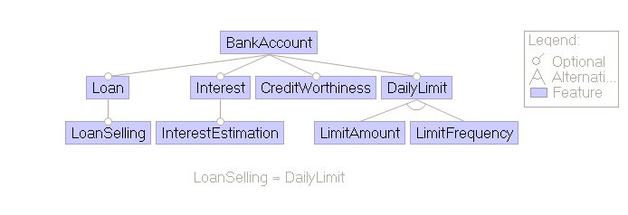
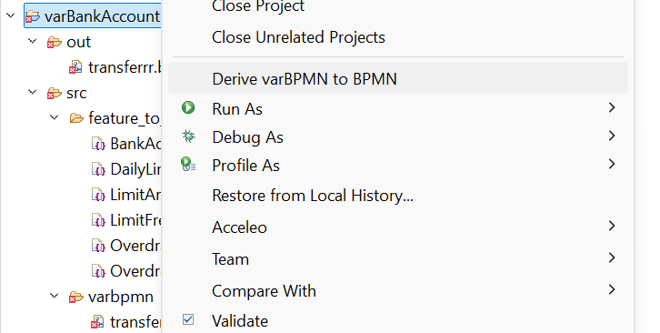
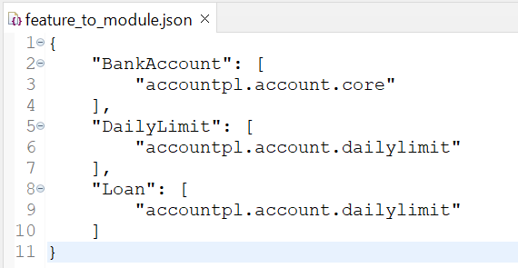
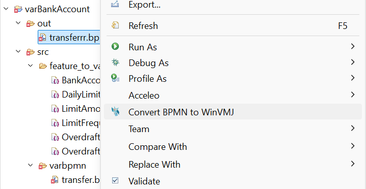
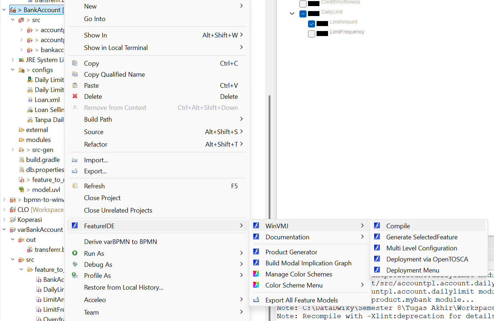

# Requirements
Install via the update site: [bpmn-to-winvmj update site](https://gitlab.com/RSE-Lab-Fasilkom-UI/PricesIDE/priceside-update-site/-/tree/bpmn-to-winvmj?ref_type=heads) or run the project locally.

# How to run the project locally
To run this project, you must first be in an eclipse application.
Then import this whole project into eclipse. This will result in you having all the modules inside your file explorer.<br>


To run the plugin as a whole, right click on the bpmn-to-winvmj-plugin folder and select "run as" > "eclipse application". This will open another eclipse instance where your plugin will be accessible to be used.

# User Manual
First, you need to prepare 2 projects: one FeatureIDE project and one general project for varBPMN.
The naming convention that were used are:
- `[Project Name]` --> FeatureIDE
- `var[Project Name]` --> varBPMN

In the varBPMN project, there are two folders: `out` and `src`. `out` is used to store the generation results, and `src` contains the `feature_to_varbpmn` and `varbpmn` folders.

**FeatureIDE Project:**<br>


**varBPMN Project:**<br>


- `varbpmn` contains the BPMN that has the varBPMN layout.
- `feature_to_varbpmn` is the JSON that holds variability value that will be attached to the varBPMN file.<br>


The JSON structure for `feature_to_varbpmn` is:
- `feature`: target feature that exists in `model.uvl`.<br>

- `targetBPMN`: name of the target BPMN file that will be annotated.
- `priority`: priority of the value mapping. When there is a collision on the same `targetBPMN` mapping item, the highest value will replace the others.
- `mappings`: a list containing element items which contain `id`, `name` (optional for visibility), and the key-value variability annotation.

Variability annotations in `feature_to_varbpmn`:
- `inclusionVariability`: value `1` (include), `2` (exclude), `3` (skip).
- `receiver`: a list of string numbers, for example `["1", "2", ...]`, containing IDs of connectors that are allowed to connect with the element.
- `connector`: an item containing `name` (connector ID) and `select` (element ID that has the receiver). For example:
  ```json
  "connector": {
      "name": "4",
      "select": "ExclusiveGateway_2"
  }
  ```

After that, to transform varBPMN to BPMN, right-click the varBPMN project and click **Derive** The program will ask for the FeatureIDE project input and configuration for the BPMN variant, and the BPMN variant will be generated in the `out` folder.<br>


To prepare for the generation of the BPMN into WinVMJ text code, you need to prepare `src` in the FeatureIDE project which contains the application modules and `feature_to_module.json`.<br>


Right-click on the generated BPMN and select `src` on the FeatureIDE project to transform the BPMN to WinVMJ code and apply it to the src in FeatureIDE Project<br>


then click **Compile** to compile the product in FeatureIDE Project.<br>


# File structure
`varbpmn-to-bpmn-transformer` is used to transform varBPMN diagrams into a normal BPMN file which then can be consumed by `bpmn-to-winvmj-acceleo` as an input.

`bpmn-to-winvmj-acceleo` is used as the primary tool to convert a BPMN file into ResourceImpl and friends codes. You can read more relating to this project in `bpmn-to-winvmj-acceleo\README.md`

Both build result of `bpmn-to-winvmj-acceleo` and `varbpmn-to-bpmn-transformer` will then be embeded inside the plugin when `bpmn-to-winvmj-plugin` is built.

To build the `bpmn-to-winvmj-plugin`, you must first remove preexisting artifacts.jar and content.jar inside `bpmn-to-winvmj-plugin-update`, then open site.xml and add the `id.ac.ui.cs.prices.bpmn.winvmj.feature` feature.

# Contributor
Here are the list of people who have contributed their blood, sweat and tears for this project
- Kenichi Komala
- Dwiky Ahmad Megananta