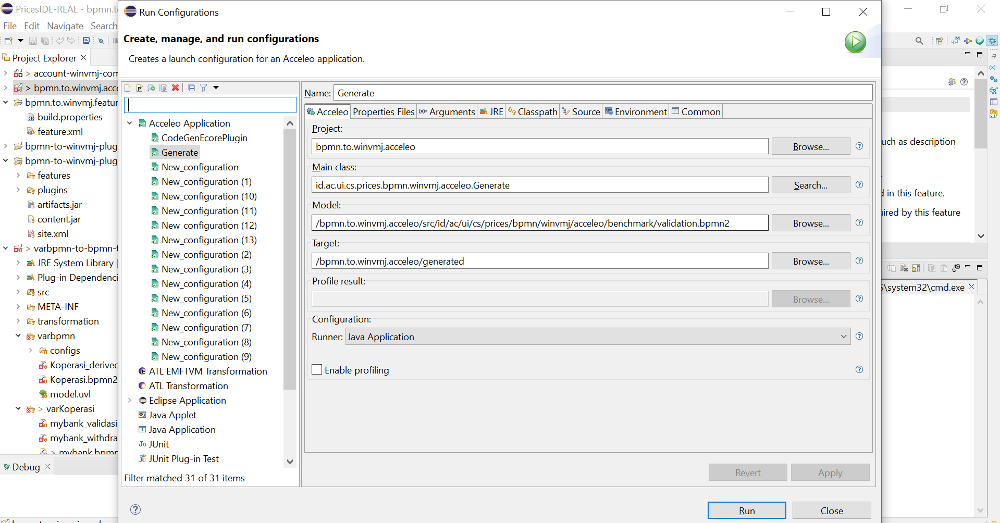

This module is the basis of BPMN to WinVMJ transformer.

# The important files
The important ones are:
- bpmn-to-winvmj-acceleo\src\id\ac\ui\cs\prices\bpmn\winvmj\acceleo\Generate.java
- bpmn-to-winvmj-acceleo\src\id\ac\ui\cs\prices\bpmn\winvmj\acceleo\Generate.mtl
- bpmn-to-winvmj-acceleo\src\id\ac\ui\cs\prices\bpmn\winvmj\acceleo\java\BPMNParser.java
- bpmn-to-winvmj-acceleo\src\id\ac\ui\cs\prices\bpmn\winvmj\acceleo\GenerateQuery.java

## Generate.java

The `Generate.java` file is the file that acceleo will execute as the main application and is responsible for deciding what becomes the input of the template we are using.
Generate will be called by our plugin app when the user uses the "convert bpmn to winvmj" menu. If you need to add new parameters into the template, this is the file you have to change first.

## Generate.mtl

The `Generate.mtl` file is the template that acceleo will use to generate the text. It also contains some acceleo queries, some of which will call a Java function inside `java/GenerateUtil.java`. 
I'm really sorry for the quality of the code in this file :D. I somehow cannot refactor it as it always resulted in build failure.

The important template in `Generate.mtl` is the `generateUserTaskResources` as it is the one responsible for generating the endpoints.
This template will use `getFormData`, `getTasksAfterStart`, `traverseAfter`, `traversePrior` queries.
- `getFormData` is to generate payloads needed by the endpoint
- `getTasksAfterStart` decide whether the endpoint is the start of a business process
- `traversePrior` generate a filter to check whether the requester has done the previous task
- `traverseAfter` generate code execution blocks based on the tasks after the endpoint. 

## BPMNParser.java
This file is responsible for grouping elements into BPEL structured activities which then will be consumed by other java files to be processed into a Java code.
You can read more in this research "From BPMN Process Models to BPEL Web Services" written by Chun Ouyang, Marlon Dumas, Arthur H.M. ter Hofstede and Wil M.P. van der Aalst.

## GenerateQuery.java
This is the God file that does most of the miracle. 
This file is responsible in transforming the result from BPMNParser into a String of Java code that will be consumed by acceleo via the acceleo query.

The main methods are:
- getServiceTaskAfter: used by the `traverseAfter`
- getPrior: used by the `traversePrior`.

there are other methods that you will need to understand but most of them will be related to these two.
Both of these methods in its simplest form is just a graph traversal algorithm that does BFS / DFS. 

**If your data structure and algorithm score is not great in this topic, I don't think you should be contributing to this file**.

**Always**, generate most of the benchmark and evaluate whether the resulting code is usable or not before deploying a newer version of the plugin.
The main files that need to be tested are mybank.bpmn2, bankaccount.bpmn2, convergings.bpmn2 (Adding more to this list in the future is recommended). 

# How to run
To run this application, you can run it like any other acceleo app.
Right click on the `bpmn-to-winvmj-acceleo` project and click "Run as" > "Run configurations". Search for "generate" and fill the menu like so and click run.

This will generate a files inside `generated/bpmn/product` search for your file name you put as "model" in the menu and voila, your codes should have been generated.
